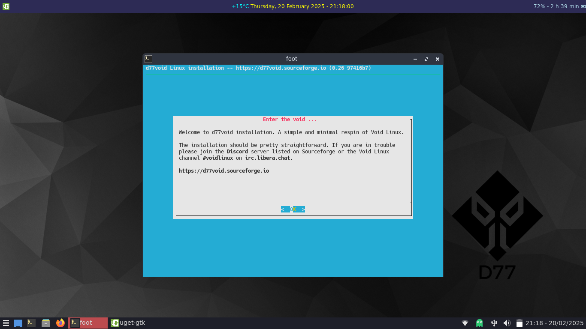
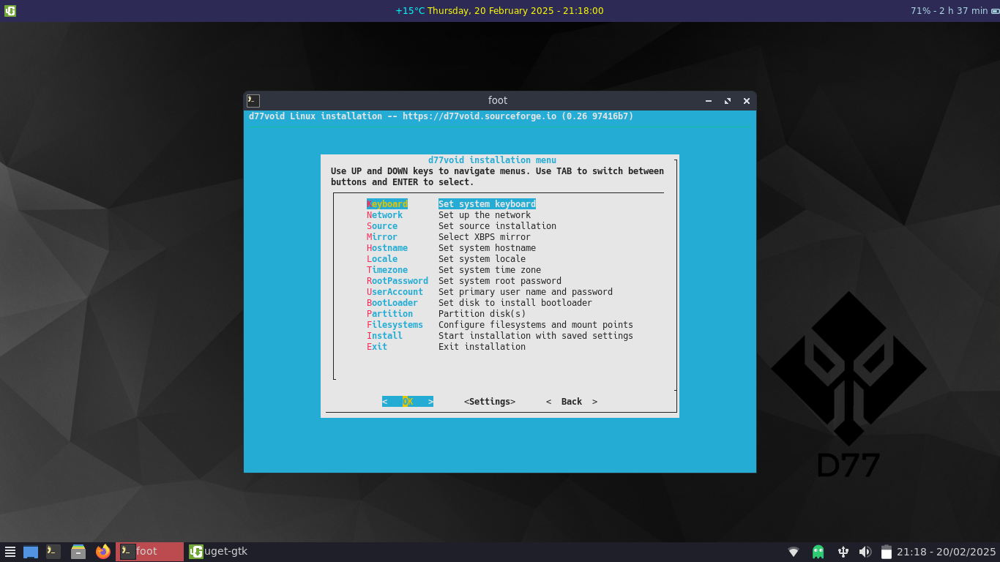

# Enter the Void

<!-- Begin SF Tag -->
<div class="sf-root" data-id="3836457" data-badge="oss-rising-star-white" data-metadata="achievement=oss-rising-star" style="width:125px">
    <a href="https://sourceforge.net/projects/d77void/" target="_blank">d77void</a>
</div>
<script>(function () {var sc=document.createElement('script');sc.async=true;sc.src='https://b.sf-syn.com/badge_js?sf_id=3836457';var p=document.getElementsByTagName('script')[0];p.parentNode.insertBefore(sc, p);})();
</script>
<!-- End SF Tag -->

This is a simple install guide for d77void;

After typing 
```
sudo void-installer
```

you will be presented with this menu.



Hit return


