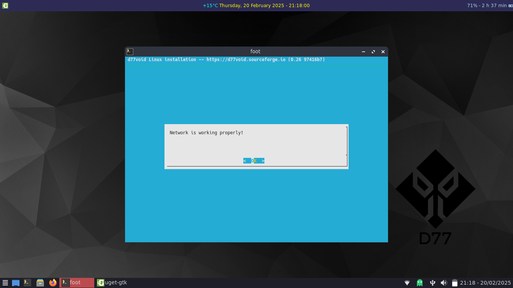

# Network, Source and Mirror

If you connected to your local network before, in network you will be presented with this slide:

just hit return and select your source choosing local to preserve live configs.

and then select a mirror (try to catch the less distant to you; in my case Germany - Frankfurt)

