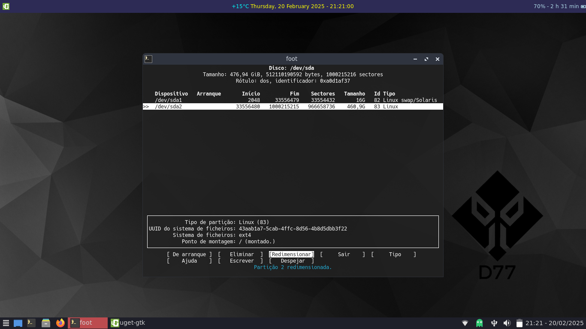

# Partition

Choose a disk to partition

In this case I will show you how to partition in a pc with Legacy bios. In case of EFI you should create a 300mb vfat partition.

I chose *cfdisk* to partition my disk this way (16Gb Swap and the remaining to / ).

Don't forget to make / partition bootable.

 
Save the work done

